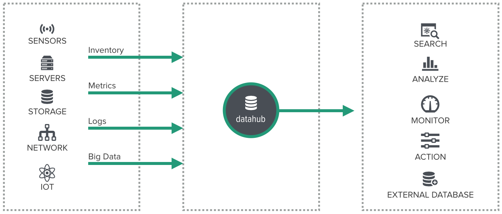

Ericsson HDS Agent
==================

What is Ericsson HDS Agent?
--------------------------
Ericsson HDS (Hyperscale Datacenter Systems) Agent is a Linux based program designed to run on any Linux System. It collects an inventory of the host machine's hardware inventory and runtime system metrics. It is composed of many built-in collectors, formatters and a forwarder.

 

### Supported Platforms:
   * LINUX/x86_64
   * LINUX/ARM_64

Getting Started
---------------

Installation from Binary Distribution
-------------------------------------
1. **Download**

   Execute the command below to download

   ```
   wget https://github.com/Ericsson/ericsson-hds-agent/blob/master/release/ericsson-hds-agent_x86_64.tar.gz
   ```

1. **Install**

   Extract the downloaded file to a directory from where the user wants to run. 
   ```
   tar -zxvf ericsson-hds-agent_x86_64.tar.gz
   ```

1. **Run**

   After the files are extracted, the program can be executed as follows. 
   ```
   cd hds-agent/

   sudo ./hds-agent -stdout
   ```
   A `node.id` file is automatically created and contains an unique identifier for this host system.

   The above command runs the inventory and metrics collectors once and sends the collected data to standard output.

   This behavior can be changed by passing different sets of command line arguments. Here are some examples.
 
   ```
   sudo ./hds-agent -stdout -frequency=60
   ```
   The above command collects metrics at an interval of 60 seconds and sends the data to standard output.
  
   ```
   sudo ./hds-agent -stdout -frequency=60 -destination=tcp:localhost:9090
   ```
   The above command collects metrics at an interval of 60 seconds and sends the data to a storage server running on port 9090. A [sample storage server](./examples/simple-storage-server.py) has been provided to ingest the data.

### Command Line Arguments and Other details  
Please refer to [detailed document](./apps/hds-agent/README.md) for a complete list of supported parameters and other details of the Ericsson HDS Agent.


Installation from Source Code
-----------------------------

### Prerequisite:
   * **git**
   * **go 1.6**

   Follow these installation and setup instruction links [**`git`**](https://www.digitalocean.com/community/tutorials/how-to-install-git-on-ubuntu-14-04) and [**`go 1.6`**](https://golang.org/doc/install) if you neeed to install.

1. **How to Download**

   User can download the Ericsson HDS Agent source code using `go` command

   ```
   go get github.com/Ericsson/ericsson-hds-agent
   ```

1. **How to Build**

   Execute the below set of commands to build hds-agent binary
   ```
   cd $GOPATH/src/github.com/Ericsson/ericsson-hds-agent/hds-agent/app/hds-agent

   go get ./...

   go build
   ```

1. **How to Run**

   After the build completes, follow below instruction to execute the Ericsson HDS Agent program. User will find node.id file being created which contains uniqueue identifier for this host system
   ```
   cd $GOPATH/src/github.com/Ericsson/ericsson-hds-agent/hds-agent/app/hds-agent
   sudo ./hds-agent -stdout
   ```

   To run with other parameters refer to section [How to Run](#installation-from-binary-distribution)

1. **How to Validate Data Being Collected**

   User can validate Ericsson HDS Agent output with system command(s)


   For example, cpu inventory data output from Ericsson HSD agent(given below) can be verified using Linux command `cat /proc/cpuinfo`
   ```
	{
	    "Category": "cpuinfo",
	    "Details": [
		{
		    "Tag": "processor",
		    "Value": "0"
		},
		{
		    "Tag": "vendor_id",
		    "Value": "GenuineIntel"
		},
		{
		    "Tag": "cpu family",
		    "Value": "6"
		},
		{
		    "Tag": "model",
		    "Value": "70"
		},
		{
		    "Tag": "model name",
		    "Value": "Intel(R) Core(TM) i7-4870HQ CPU @ 2.50GHz"
		},
		...
	    ]
	}
   ```

1. **How to Use the Data**  
In this example, the inventory and metrics data from the Ericsson HDS Agent can be viewed on a dashboard to analyze the inventory of the data center and how each machine would operate. 


